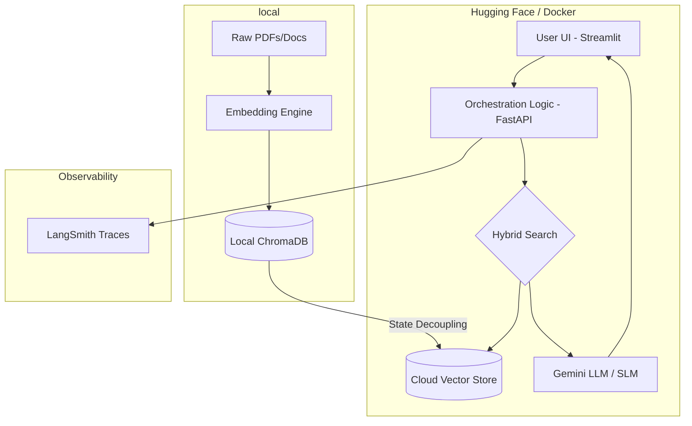

# Engineering the Agentic Lifecycle

This Space hosts the "Intelligence Plumbing" for the **aiassembled** project, focusing on RAG optimization and multi-agent orchestration.

## 🚀 Overview

This project deploys a dual-process container running:

* **FastAPI/Uvicorn** on port 8000 (Backend Logic)
* **Streamlit** on port 7860 (User Interface)

## 🏛️ Architecture Highlights

* **Runtime:** Custom Docker container (Python 3.11-slim).
* **Vector Store:** Local ChromaDB (`chroma_db/`) pre-baked for warm-start performance.
* **Orchestration:** Multi-agent resilient architecture for agentic workflows.

## 📁 Repository Structure

* `deployments/`: Main application entry points (UI and API).
* `src/`: Core logic for RAG pipelines and hybrid retrieval.
* `chroma_db/`: Persistent vector storage (excluded from frequent uploads via `.hfignore`).
* `Dockerfile`: Container configuration for Hugging Face Spaces.

## 🛠️ Configuration

Since the `.env` file is excluded for security, ensure the following **Secrets** are configured in the Hugging Face Settings:

* `GOOGLE_API_KEY`: Required for Gemini/LLM access.
* `PYTHONPATH`: Set to `/app` within the container environment.